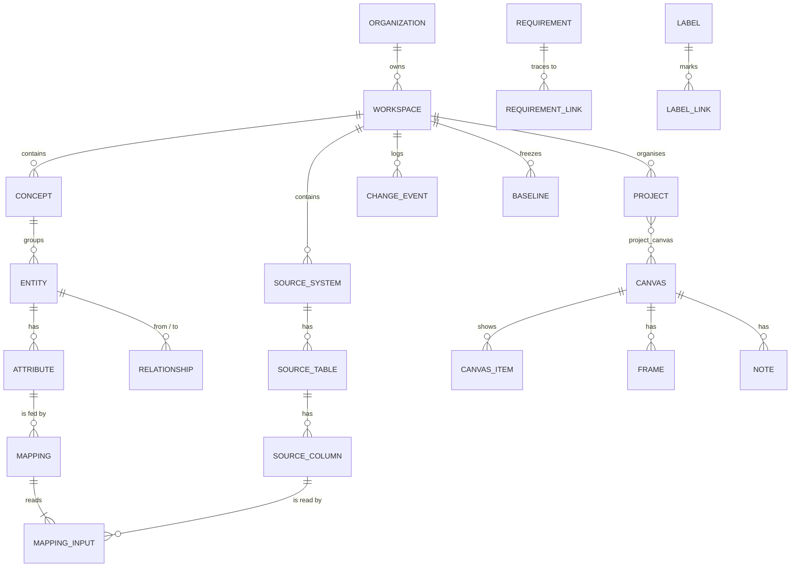

# InfoMapper – Data Model v2

Version 2.0 · 2 October 2026 · replaces `INFOMAPPER_DATA_MODEL_v1_0.md` (the old application is not migrated, D-40)

This document describes every table of the new InfoMapper application: what it holds, its columns, keys and rules.
The SQL is in `supabase/migrations/20261002000000_initial_schema.sql`. Behaviour is defined by the prototype
(`docs/prototype/infomapper-model-prototype.html`); the decisions behind this model are listed at the end.

---

## 1. Shape of the model

One **workspace** holds one model (concepts, entities, attributes, sources, mappings, requirements) and the work
organised around it (projects, canvases, labels, notes). Workspaces belong to organizations and are fully isolated
from each other: every model and work table carries `workspace_id`.

Table groups (AD-10):

| Group | Tables |
| --- | --- |
| Tenancy and access | `app_user`, `organization`, `organization_member`, `workspace`, `workspace_member`, `invitation` |
| Model | `concept`, `entity`, `attribute`, `relationship` |
| Sources | `source_system`, `source_table`, `source_column` |
| Mappings | `mapping`, `mapping_input` |
| Requirements | `requirement`, `requirement_link` |
| Working layer | `label`, `label_link`, `note` |
| Organisation of work | `project`, `project_canvas`, `project_pinned_label`, `canvas`, `canvas_item`, `frame` |
| History | `change_event`, `baseline` |

---

## 2. Conventions

**Names.** Tables and columns in `snake_case`, tables in the singular. Foreign keys are `<table>_id`.

**Identifiers (AD-11).** Every row has `id uuid`, generated by the application as UUID version 7 (time-ordered).
The database never generates ids. Human-readable keys exist only where people use them (`requirement.key`,
e.g. `REQ-104`), numbered per workspace.

**Standard columns (AD-12).** Every model and work table has:

| Column | Type | Meaning |
| --- | --- | --- |
| `id` | uuid | primary key |
| `workspace_id` | uuid | the workspace; all queries filter on it |
| `version` | integer | starts at 1, +1 on every update; an update must state the version it read (optimistic concurrency) |
| `created_at`, `created_by` | timestamptz, uuid | when and by whom |
| `updated_at`, `updated_by` | timestamptz, uuid | last change |
| `deleted_at` | timestamptz, null | soft delete; rows with a value are hidden everywhere but history and undo |

**Closed value lists.** Stored as `text` with a `CHECK` constraint, never as database enum types (AD-18). Values are
lower-case English words, e.g. `status in ('draft','review','approved')`. The UI shows its own labels.

**Rich text (AD-17).** Longer texts are a pair of columns: `<name>_html` (sanitized HTML, allow-list:
`p br strong em ul ol li sup sub h4 a[href http/https/mailto] span.tc-warn|attn|ok|info`) and `<name>_text`
(plain text, derived by the server, used for search, tooltips and exports). Both are written together by the server;
the client never writes `_text`.

**JSON (AD-18).** Only three places use JSON: `canvas.look`, `baseline.snapshot` and the before/after images in
`change_event`. Everything that is queried, filtered or joined is a real column.

**Portability (AD-18).** The model core avoids database-specific features: no enum types, no triggers, no stored
functions, no arrays. Logic lives in the application's `domain` layer (AD-19). Partial unique indexes
(`... where deleted_at is null`) are used; SQL Server has the equivalent filtered unique indexes.
Supabase-specific features (Row Level Security, extensions for search) may be used outside the core, never as the
only line of defence (AD-23).

**Deleting.** All deletes are soft. When the domain deletes an entity it also soft-deletes its attributes, its
mappings, their inputs, its relationships and its links, in one change group (D-47). Hard deletes happen only when a
workspace is deleted after export (AD-09).

---

## 3. Tenancy and access

### `app_user`
A person who can sign in. With Supabase, `id` equals the id of the Supabase Auth user; there is deliberately no foreign
key into the `auth` schema, so the table works with any identity provider later.

| Column | Type | Null | Notes |
| --- | --- | --- | --- |
| `id` | uuid | no | primary key; the auth provider's user id |
| `email` | text | no | unique, lower-case |
| `display_name` | text | no | |
| `created_at` | timestamptz | no | |
| `last_seen_at` | timestamptz | yes | |

### `organization`
| Column | Type | Null | Notes |
| --- | --- | --- | --- |
| `id`, `version`, `created_*`, `updated_*`, `deleted_at` | | | standard (no `workspace_id`) |
| `name` | text | no | e.g. InfoMate |

### `organization_member`
A person can belong to several organizations (AD-01).

| Column | Type | Null | Notes |
| --- | --- | --- | --- |
| `organization_id` | uuid | no | PK part, FK `organization` |
| `user_id` | uuid | no | PK part, FK `app_user` |
| `role` | text | no | `owner`, `admin`, `member` |
| `created_at` | timestamptz | no | |

### `workspace`
One model with its people, settings and baselines (AD-01, AD-07 – AD-09).

| Column | Type | Null | Notes |
| --- | --- | --- | --- |
| `id`, `version`, `created_*`, `updated_*`, `deleted_at` | | | standard |
| `organization_id` | uuid | no | FK `organization`; changes on transfer (AD-09) |
| `name` | text | no | |
| `client_name` | text | yes | |
| `description` | text | yes | |
| `doc_language` | text | no | `en`, `pl`, `de` |
| `dv2_mode` | boolean | no | Data Vault 2.0 hints (AD-08), default false |
| `four_eyes` | boolean | no | author cannot approve own change (AD-06), default false |
| `archived_at` | timestamptz | yes | set = read-only (AD-09) |
| `archived_by` | uuid | yes | |
| `requirement_key_next` | integer | no | next number for `REQ-…`, default 101 |

### `workspace_member`
Roles are per workspace (AD-05). A guest is a member whose user is not a member of the workspace's organization;
that is derived, not stored.

| Column | Type | Null | Notes |
| --- | --- | --- | --- |
| `workspace_id` | uuid | no | PK part |
| `user_id` | uuid | no | PK part |
| `role` | text | no | `owner`, `admin`, `modeler`, `reviewer`, `reader` |
| `added_by` | uuid | yes | |
| `created_at` | timestamptz | no | |

### `invitation`
| Column | Type | Null | Notes |
| --- | --- | --- | --- |
| `id`, `workspace_id` | uuid | no | |
| `email` | text | no | lower-case |
| `role` | text | no | as `workspace_member.role` |
| `token_hash` | text | no | unique; the token itself is only in the e-mail |
| `invited_by`, `created_at` | | no | |
| `expires_at` | timestamptz | no | |
| `accepted_at`, `revoked_at` | timestamptz | yes | |

---

## 4. Model

### `concept`
| Column | Type | Null | Notes |
| --- | --- | --- | --- |
| standard columns | | | |
| `name` | text | no | |
| `description_html`, `description_text` | text | yes | rich text |
| `color` | text | no | `#RRGGBB` from the workspace palette; violet is reserved for requirements (D-41) |
| `sort_order` | integer | no | order in the left panel |

### `entity`
| Column | Type | Null | Notes |
| --- | --- | --- | --- |
| standard columns | | | |
| `concept_id` | uuid | no | FK `concept` |
| `name` | text | no | not unique; the domain warns on duplicates (B-25) |
| `stereotype` | text | no | `object`, `link`, `dictionary`, `context`, `informative` |
| `definition_html`, `definition_text` | text | yes | rich text (D-42) |

### `attribute`
| Column | Type | Null | Notes |
| --- | --- | --- | --- |
| standard columns | | | |
| `entity_id` | uuid | no | FK `entity` |
| `name` | text | no | |
| `sort_order` | integer | no | position on the entity; belongs to the model (D-36) |
| `data_type` | text | no | `string`, `integer`, `decimal`, `boolean`, `date`, `datetime`, `json`, `custom` |
| `custom_type` | text | yes | when `data_type = 'custom'`, e.g. `uuid`, `geography` |
| `type_length` | integer | yes | e.g. 100 for a string (AD-27) |
| `type_precision`, `type_scale` | integer | yes | e.g. 18, 2 for a decimal (AD-27) |
| `is_primary_key` | boolean | no | |
| `is_foreign_key` | boolean | no | |
| `is_business_key` | boolean | no | the modeller's decision (AD-28); suggested from source columns marked BK |
| `is_pii` | boolean | no | personal data |
| `is_nullable` | boolean | no | |
| `definition_html`, `definition_text` | text | yes | rich text (D-42) |

### `relationship`
| Column | Type | Null | Notes |
| --- | --- | --- | --- |
| standard columns | | | |
| `from_entity_id`, `to_entity_id` | uuid | no | FK `entity` |
| `label` | text | yes | e.g. “places” |
| `from_min`, `to_min` | smallint | no | 0 or 1 |
| `from_max`, `to_max` | text | no | `1` or `n` |
| `description` | text | yes | |

Notation (crow’s foot or UML) is a display choice per user, not data (D-22).

---

## 5. Sources

### `source_system`
| Column | Type | Null | Notes |
| --- | --- | --- | --- |
| standard columns | | | |
| `name` | text | no | e.g. CRM, ERP; unique per workspace among non-deleted rows |
| `description` | text | yes | |

### `source_table`
Database and schema are fields of the table, not tables of their own (AD-10).

| Column | Type | Null | Notes |
| --- | --- | --- | --- |
| standard columns | | | |
| `source_system_id` | uuid | no | FK `source_system` |
| `database_name` | text | no | e.g. `crmprod` |
| `schema_name` | text | no | e.g. `dbo` |
| `name` | text | no | unique per system + database + schema among non-deleted rows |
| `object_type` | text | no | `table`, `view` |
| `row_count` | bigint | yes | |
| `comment` | text | yes | |

### `source_column`
| Column | Type | Null | Notes |
| --- | --- | --- | --- |
| standard columns | | | |
| `source_table_id` | uuid | no | FK `source_table` |
| `name` | text | no | unique per table among non-deleted rows |
| `ordinal` | integer | no | physical position, never reordered by users (D-36) |
| `data_type` | text | no | physical type as in the source, e.g. `varchar`, `decimal` |
| `type_length`, `type_precision`, `type_scale` | integer | yes | |
| `is_nullable`, `is_primary_key`, `is_foreign_key` | boolean | no | |
| `is_business_key` | boolean | no | column classification BK |
| `is_pii` | boolean | no | column classification PII |
| `default_value`, `comment` | text | yes | |

---

## 6. Mappings

A mapping says how one attribute is filled. It reads one or more source columns (AD-26).
It is a model object, independent of any canvas (D-02).

### `mapping`
| Column | Type | Null | Notes |
| --- | --- | --- | --- |
| standard columns | | | |
| `attribute_id` | uuid | no | FK `attribute`; an attribute can have several mappings (e.g. one per source system) |
| `kind` | text | no | `direct` (copy one column) or `transform` (rule) |
| `rule_expression` | text | yes | required when `kind = 'transform'`; code field, not rich text (D-42) |
| `status` | text | no | `draft`, `review`, `approved` |
| `note_html`, `note_text` | text | yes | why, open questions |
| `approved_by`, `approved_at` | uuid, timestamptz | yes | set when status becomes `approved`; four-eyes checked by the domain (AD-06) |

### `mapping_input`
| Column | Type | Null | Notes |
| --- | --- | --- | --- |
| standard columns | | | |
| `mapping_id` | uuid | no | FK `mapping` |
| `source_column_id` | uuid | no | FK `source_column`; unique per mapping among non-deleted rows |
| `sort_order` | integer | no | order used in the rule, e.g. first name then last name |

Rules kept in the domain layer: a `direct` mapping has exactly one input; a `transform` mapping has at least one.
Type checking (D-01) compares the attribute's type and parameters with each input column.

---

## 7. Requirements

### `requirement`
| Column | Type | Null | Notes |
| --- | --- | --- | --- |
| standard columns | | | |
| `key` | text | no | `REQ-104`; unique per workspace (AD-11) |
| `kind` | text | no | `need`, `data`, `business_rule`, `dq_rule`, `non_functional` (D-30) |
| `name` | text | no | |
| `description_html`, `description_text` | text | yes | rich text with kind templates (D-42, D-44) |
| `expression` | text | yes | for `business_rule` and `dq_rule` |
| `severity` | text | yes | `warn`, `block`; for `dq_rule` |
| `status` | text | no | `draft`, `agreed`, `implemented`, `verified` |
| `priority` | text | no | `must`, `should`, `could`, `wont` |
| `owner_name` | text | yes | business owner as text |
| `external_ref` | text | yes | e.g. `JIRA-481` |
| `parent_id` | uuid | yes | FK `requirement`; break-down |

Coverage is computed, never stored (D-31).

### `requirement_link`
One table with one nullable foreign key per kind of target and a check that exactly one is set (AD-15).

| Column | Type | Null | Notes |
| --- | --- | --- | --- |
| standard columns | | | |
| `requirement_id` | uuid | no | |
| `entity_id`, `attribute_id`, `mapping_id`, `source_table_id`, `source_column_id` | uuid | yes | exactly one set |

---

## 8. Working layer

### `label`
| Column | Type | Null | Notes |
| --- | --- | --- | --- |
| standard columns | | | |
| `name` | text | no | e.g. `CR-23`; unique per workspace, case-insensitive (`name_key` = lower-case copy) |
| `name_key` | text | no | written by the server; carries the unique index (portable) |

### `label_link`
Same pattern as `requirement_link` (D-08, D-25): `label_id` plus exactly one of `entity_id`, `attribute_id`,
`mapping_id`, `source_table_id`, `source_column_id`.

### `note`
Notes belong to a canvas and the working layer (D-20, D-21).

| Column | Type | Null | Notes |
| --- | --- | --- | --- |
| standard columns | | | |
| `canvas_id` | uuid | no | |
| `body_html`, `body_text` | text | yes | rich text |
| `color` | text | no | `yellow`, `blue`, `green`, `pink`, `grey` |
| `status` | text | no | `open`, `resolved` |
| `resolved_at`, `resolved_by` | | yes | |
| `width` | integer | no | |
| `pin_canvas_item_id` | uuid | yes | pinned to a card |
| `pin_frame_id` | uuid | yes | pinned to a frame; at most one pin |
| `x`, `y` | numeric | no | free note: canvas position; pinned note: offset from the pinned element |
| `frame_id` | uuid | yes | membership of a free note in a frame |

---

## 9. Organisation of work

### `project`
| Column | Type | Null | Notes |
| --- | --- | --- | --- |
| standard columns | | | |
| `name` | text | no | |
| `description` | text | yes | |

### `project_canvas`
A canvas can belong to several projects (D-28).

| Column | Type | Null | Notes |
| --- | --- | --- | --- |
| `project_id`, `canvas_id` | uuid | no | primary key |
| `workspace_id` | uuid | no | |
| `sort_order` | integer | no | tab order in the project |
| `added_at`, `added_by` | | no | |

### `project_pinned_label`
`project_id`, `label_id` (primary key), `workspace_id` (D-29).

### `canvas`
| Column | Type | Null | Notes |
| --- | --- | --- | --- |
| standard columns | | | |
| `name` | text | no | |
| `live_label_id` | uuid | yes | set = live label canvas (D-10, D-25) |
| `look` | jsonb | no | `{ "background": "grey", "grid": "dots", "layer": "all" }` (D-12, D-22) |

### `canvas_item`
One card on one canvas (AD-16). Layout belongs to the canvas, not the model (D-04, D-37).

| Column | Type | Null | Notes |
| --- | --- | --- | --- |
| standard columns | | | |
| `canvas_id` | uuid | no | |
| `entity_id`, `source_table_id`, `requirement_id` | uuid | yes | exactly one set; unique per canvas among non-deleted rows |
| `x`, `y` | numeric | no | |
| `width` | integer | yes | null = default 256; 200–600 (D-37) |
| `collapsed` | boolean | no | |
| `row_filter` | text | no | `all`, `mapped`, `unmapped`, `keys`, `labeled` |
| `frame_id` | uuid | yes | frame membership |
| `live_level` | text | yes | `full`, `context`; only on live canvases |

### `frame`
| Column | Type | Null | Notes |
| --- | --- | --- | --- |
| standard columns | | | |
| `canvas_id` | uuid | no | |
| `name` | text | no | |
| `kind` | text | no | `concept`, `source_system`, `free` |
| `concept_id` | uuid | yes | when `kind = 'concept'` |
| `source_system_id` | uuid | yes | when `kind = 'source_system'` |
| `color` | text | yes | for free frames |
| `x`, `y`, `width`, `height` | numeric | no | |
| `collapsed` | boolean | no | (D-07) |

---

## 10. History

### `change_event`
Append-only log of every change (AD-13). One user action is one `change_group_id`, which is also the unit of undo.

| Column | Type | Null | Notes |
| --- | --- | --- | --- |
| `id` | uuid | no | |
| `workspace_id` | uuid | no | |
| `change_group_id` | uuid | no | groups the events of one action |
| `occurred_at` | timestamptz | no | |
| `user_id` | uuid | no | |
| `object_type` | text | no | table name, e.g. `mapping` |
| `object_id` | uuid | no | |
| `operation` | text | no | `create`, `update`, `delete`, `restore` |
| `before_image`, `after_image` | jsonb | yes | the row before and after |
| `context_label_id` | uuid | yes | the active working context (D-26) |

Images: `create` has only an after image; `update` and `restore` have both. A soft `delete` has both (the after
image carries `deleted_at`). Link rows without `deleted_at` (`project_canvas`, `workspace_member`, …) are removed,
not soft-deleted: their `delete` event has a before image and a null after image. Link tables have no `id`, so
`object_id` names the moved thing (the canvas for `project_canvas`, the user for `workspace_member`); the images
always contain the full row with both keys.

### `baseline`
A frozen, named snapshot of the model part of a workspace (AD-03, AD-14).

| Column | Type | Null | Notes |
| --- | --- | --- | --- |
| `id`, `workspace_id` | uuid | no | |
| `name` | text | no | e.g. “Stage 1 sign-off” |
| `note` | text | yes | |
| `created_at`, `created_by` | | no | |
| `snapshot` | jsonb | no | concepts, entities, attributes, relationships, sources, mappings with inputs, requirements with links |
| `snapshot_schema` | integer | no | version of the snapshot format, starts at 1 |

---

## 11. Rules kept in the domain layer

The database guarantees keys, references, closed value lists and uniqueness. These rules live in `domain` (AD-19),
because they are business logic or must work on any database:

- Permissions per role (AD-05), archive read-only (AD-09), four-eyes approval (AD-06).
- Mapping input counts (section 6) and type checking.
- Duplicate-name warnings for entities (B-25); concept deletion moves entities first (D-47).
- Soft-delete cascades and the impact preview before deleting an entity (D-47).
- Requirement coverage and scope (D-31), live label canvas membership (D-10, D-25), auto-labeling in an active
  working context (D-26).
- Rich text sanitizing and the `_text` copy (AD-17).
- `version` checks on update (AD-12) and writing `change_event` in the same transaction as the change (AD-13).

## 12. Not stored on the server

Per-user, per-browser preferences stay in the browser: panel widths, folded groups and sections, notation,
the last view of each canvas, navigation history. They can move to a `user_preference` table later.

## 13. What changed from v1.0

| v1.0 | v2 |
| --- | --- |
| `Connection` tied to a diagram item, used for both mappings and requirement links | `mapping` + `mapping_input` as model objects; `requirement_link` separate |
| Sources in a separate storage key, five levels | `source_system` → `source_table` (database, schema as fields) → `source_column` |
| `Requirement` / `RequirementRow` mismatch, random display ids | one `requirement` table, `REQ-…` keys numbered per workspace |
| Positions in `items` and `modelItems` arrays | `canvas`, `canvas_item`, `frame`, `note`; canvases in several projects |
| No validation of references | foreign keys everywhere, “exactly one target” checks |
| localStorage | Postgres (Supabase), portable core |

## 14. Decisions behind this model

UX decisions (backlog document): D-02, D-04, D-07, D-08, D-10, D-12, D-20 – D-22, D-25, D-26, D-28 – D-31, D-36,
D-37, D-40 – D-42, D-44, D-47.
Architecture decisions (decision map): AD-01, AD-03, AD-05, AD-06, AD-08 – AD-19, AD-23, AD-26 – AD-28.
