# Spike report: canvas engine (React Flow), AD-24

Oct 2, 2026 · spike in `/spikes/canvas-react-flow` · brief: `docs/spike-canvas-react-flow.md`

## Summary

- **React Flow does all the behaviour.** Rows, row-to-row lines, re-anchoring, relationships with crow's foot and UML ends, frames with collapse and merged lines, lasso, Shift-click, group drag, card width, highlight and minimap all work, and the scripted checks pass. The workarounds needed are small, and most are stable.
- **React Flow fails on pan and zoom smoothness (C-01).** Out of the box it pans at **9–15 fps** on a business laptop. With two CSS fixes found in the spike it reaches **41–45 fps**, still below 50. The fix that gets it there makes card resizing and hover highlighting much slower (C-09, C-10).
- **The limit is the amount of DOM, not React Flow.** The same cards and lines drawn as plain DOM with one SVG, the way the prototype does it, pan at **12–17 fps**: no better than React Flow. An own engine "modeled on the prototype" would hit the same limit.
- **Follow-up (Oct 3):** with detail by zoom level, no row handles and one line layer, C-01 passes in setup B (58–60 fps, no frame over 50 ms); C-09 and C-10 still fail in B. See [Follow-up](#follow-up).
- **Recommendation:** a hybrid. Keep React Flow for interaction and the viewport. Change what the canvas paints (detail by zoom level, no per-row handles), and confirm it with a one-day follow-up before AD-24 is closed. Details in the [Recommendation](#recommendation) section.

## Set-up

| | |
| --- | --- |
| Machine | Intel i7-8550U (4 cores / 8 threads), Intel UHD Graphics 620, 7.9 GB RAM, Windows 11 |
| Browser | Google Chrome 154, visible window, GPU raster (ANGLE / D3D11), 1536 × 864 viewport, DPR 1 |
| App | `next build` + `next start` (production), Next.js 16.3, React 19.3, `@xyflow/react` 12.12.0 |
| Data | Seeded: 60 source tables (8–40 columns), 40 entities (5–25 attributes), 1 entity with 200 attributes, 300 mappings, 40 relationships, 8 frames (6–14 cards each). That is 101 cards, 109 React Flow nodes, 340 lines, about 17,900 DOM elements, 4,674 row handles |
| Frame timing | The app's FPS readout records every animation-frame interval. Chrome's Long Animation Frames API counts frames over 50 ms. A Chrome performance trace was used to diagnose C-01 |
| Input | Pan and zoom: one wheel event per frame, sent inside the page. Drag, resize, lasso and hover: real mouse input through Playwright |

Runs vary by about ±5 fps. All raw numbers are in `report/results*.json`.

## Results

Three setups were measured. They differ only in CSS and one style property:

- **A, out of the box:** React Flow as you would first build it. `report/results-before-workaround.json`
- **B, `will-change` always on:** the spike's default. `report/results.json`
- **C, `will-change` only while moving:** `report/results-wc-move.json`

Pass or fail is given for the best setup, with the trade-off noted.

| ID | Criterion | Measured | Result |
| --- | --- | --- | --- |
| C-01 | Pan and zoom, 100 cards and 340 lines: ≥ 50 fps on average, no frame > 50 ms | **A:** 7.6 fps at overview, 14.3 fps at 100%; 73–136 frames over 50 ms. **B:** 40.9 fps overview, 44.5 fps at 100%; 2–3 frames over 50 ms (longest 217 ms). **C:** 25.5 / 25.7 fps. B with `onlyRenderVisibleElements`: 50.0 fps at 100% but 20 frames over 50 ms | **Fail** |
| C-02 | Drag one card and a 15-card group, ≥ 45 fps | One card: 60 fps, longest frame 17 ms. 15 cards with 85 lines attached: 60 fps, longest 17 ms. Same in all setups | **Pass** |
| C-03 | Lines attach to the exact row, facing side, at 25%, 100% and 300% | Playwright reads each drawn line end on screen: **600/600** ends inside their row and on the facing side at each zoom level, and again after moving the 200-row card into the middle | **Pass** |
| C-04 | The 200-row card renders and pans without lag; lines stay attached | The card is 5,266 px tall and renders with the rest. Panning along it for 10 s: A 30.7 fps, **B 42.4 fps, no frame over 50 ms**, C 42.1 fps. 50/50 line ends attached afterwards | **Fail** if C-01's 50 fps bar applies (lines: pass) |
| C-05 | Hidden rows (collapse, filter) re-anchor lines to the header | Collapsing a card moves all its line ends to the header and fades the lines; expanding restores them (600/600). Filtering to key rows re-anchors exactly the hidden rows' lines | **Pass** |
| C-06 | Frame drag moves its cards; collapse merges lines per target with a count; expand restores the exact layout | All 8 frames dragged: every member moves the same distance (error < 1e-6 px) and nothing else moves. Each frame collapsed: merged lines exactly match the expected per-target groups and counts. Expanding gives identical positions. Collapsing all 8 and expanding restores the layout and all 340 lines | **Pass** |
| C-07 | Lasso selects only fully enclosed cards; Shift-click and group move work | A lasso around two cards that cuts through a third selects exactly the two. A lasso that only touches a card selects nothing. Shift-click adds and removes. The group drags as one, arrow keys nudge it, and clicking empty canvas clears it | **Pass** (workaround 5) |
| C-08 | Initial render under 1.5 s | Navigation start to the first frame with all 109 nodes measured and all 340 lines drawn, 5 cold loads: **B median 1,061 ms**, max 1,176 ms (A: 1,143 ms) | **Pass** |
| C-09 | Card width resize with live line updates (should) | Lines follow live: all 25 ends sit on the card edges mid-drag. Smoothness while dragging the 200-row card's edge: **A 19.7 fps**, **B 3.6 fps**, C 24.6 fps | **Fail** on smoothness |
| C-10 | Row hover highlights lines and far-end rows, no visible delay (should) | React update: 2 ms. Hover to next frame: **A 105 ms**, **B 403 ms**, C 99 ms (median). Continuous hover sweep: A 41.7 fps, B 26.6 fps, C 46.0 fps | **Fail** (delay of about 100 ms or more is visible) |
| C-11 | Crow's foot and UML ends, edge labels (should) | Ported from the prototype's `ieMarker` / `umlMarker`. Sharp at 300% (`report/c11-*.png`). Labels as pills at the curve's midpoint | **Pass** |
| C-12 | Licence, bundle, SSR, theming, keyboard (should) | See [C-12 facts](#c-12-practical-fit) | **Pass** (with notes) |

**Must-haves:** 6 of 8 pass (C-02, C-03, C-05, C-06, C-07, C-08). C-01 fails, and C-04 fails on the same bar.

**Should-haves:** C-11 and C-12 pass. C-09 and C-10 fail on smoothness.

## Why C-01 fails

The diagnosis was done with throwaway scripts that are not in the spike. The comparisons can be repeated with the URL switches in the README and the `/baseline` page. Numbers are 4–5 s pans in setup A unless noted:

1. **The time goes to painting, not JavaScript.** During a pan React does no rendering work; the only DOM change is the canvas's `transform`. The trace shows about 4.9 s of GPU raster per 5 s and about 1.1 s of paint plus 0.9 s of layerising on the main thread. Chrome repaints every visible card and line on each frame.
2. **What costs it:** at overview zoom it's the cards (hiding them: 10 → 51 fps). At 100% it's the lines (hiding them: 15 → 39 fps). The minimap, the row handles' size and the shadows hardly matter.
3. **Plain DOM is no faster.** `/baseline` draws the same content without React Flow, as the prototype does, and pans at 12.3 / 16.7 fps.
4. **The usual fix needs one extra change in React Flow.** `will-change: transform` lets Chrome move the canvas as one finished layer. Plain DOM then pans at 51 fps. React Flow did not improve at first: the 4,674 row handles were hidden with `opacity: 0`, and that many opacity effects stop Chrome from moving the layer as one piece. Hiding them with `visibility: hidden` instead brings React Flow to 41–45 fps. Removing the dotted background and the minimap adds about 3–5 fps, which is within the run-to-run noise.
5. **The fix has a cost.** With the whole canvas on one GPU layer, any change inside it forces Chrome to re-render that very large layer. That is why resize drops to 3.6 fps and hover takes 400 ms in setup B. Turning `will-change` on only while moving (setup C) avoids that, but pan then only reaches about 25 fps.

So no setup of a DOM-based canvas with this much content reaches 50 fps on a UHD 620 while also keeping hover and resize fast. React Flow adds two specific costs on top: one `<svg>` per line (340 in all) and a DOM handle per row. Both can be avoided, as noted below.

## Workarounds used and how fragile they are

| # | Workaround | Why | Fragility |
| --- | --- | --- | --- |
| 1 | Custom lines ignore the positions React Flow passes for the declared handles. They compute both ends themselves from the internal node (`useInternalNode` → `internals.handleBounds`, measured size) and pick the facing sides | React Flow ties a line to a fixed handle; the brief needs a curve from the row on whichever side faces the other card | **Medium**: relies on `internals.handleBounds`, which is exposed but marked internal in v12. In a product the row positions could be computed from data, as the prototype does |
| 2 | Every handle is a `source` with `ConnectionMode.Loose`; each card also has header handles that lines declare | React Flow requires valid handles; this keeps it happy while workaround 1 does the real geometry | Low |
| 3 | Relationship markers drawn as SVG paths, not React Flow markers | Built-in markers are arrows only, with no crow's foot, cardinality or notation switch | Low |
| 4 | Collapsed frames: the frame node becomes the block and its cards get `hidden`. Merged lines are computed outside React Flow | React Flow has no merged lines | Low (public API) |
| 5 | CSS: the selection box after a lasso doesn't capture clicks | Otherwise it swallows Shift-clicks on cards inside the selected group's bounding box | Low (CSS class) |
| 6 | CSS: the card-width resize control widened from about 1 px to 10 px | Too thin to grab | Low |
| 7 | Highlight state kept outside React Flow; fading done with one CSS class on the canvas | Avoids re-rendering 99 faded cards on every hover | Low |
| 8 | `will-change: transform` set on `.react-flow__viewport` through the DOM | C-01; see the trade-off above | **Medium**: depends on a class name, and it slows resize and hover |
| 9 | No `opacity` on per-row or per-card elements; `visibility` and `stroke-opacity` instead | Thousands of opacity effects stop Chrome from moving the canvas as one layer | Low, but it becomes a rule every card component must follow |
| 10 | React Flow's dotted `<Background>` off | It repaints on every pan frame | Low |

Open issues the spike found but did not fix:
- **Lines cover frame labels.** Lines are drawn above frame nodes, so they can cover a frame's label and catch the click meant to drag it. The C-06 script grabs the frame at an uncovered point; the product would need the label above the lines.
- **Markers can overlap.** Two different relationships that end at the same spot of a card draw their markers on top of each other. The prototype behaves the same way.
- **Pages must be visible to render.** React Flow measures cards with a ResizeObserver, so a hidden or background tab doesn't lay out the cards. This doesn't affect real use, but tests and measurements must run in a visible page.

## C-12 practical fit

- **Licence:** `@xyflow/react` 12.12.0 and `@xyflow/system` are MIT. The paid React Flow Pro subscription is not needed for anything in this spike.
- **Bundle:** in the production build, the client chunk with React Flow and the spike's canvas code is 187 KB raw / **60 KB gzip**. All client JavaScript for the app (React, the Next runtime, both pages) is 763 KB raw / 239 KB gzip. CSS is 25 KB raw in total (React Flow's stylesheet plus the spike's).
- **Server rendering:** the canvas is loaded on the client only. React Flow 12 can render on the server when every node's width and height are given up front. Our card heights come from the rendered rows (collapse, filter), so client-only is the practical choice; the rest of the page can still be server-rendered. Initial render is 1.06 s either way.
- **Theming:** React Flow exposes 85 `--xy-*` CSS variables and a `colorMode` prop. The spike draws everything with its own classes using the prototype's colour tokens, including the dark set; dark mode was not checked visually.
- **Keyboard:** nodes are focusable, arrow keys move the selection (checked in C-07), and labels are configurable (`ariaLabelConfig`). Rows inside cards are not reachable by keyboard; that would be our own work in either engine.

## Screenshots

| | |
| --- | --- |
| The 200-row card, whole canvas, 15% | 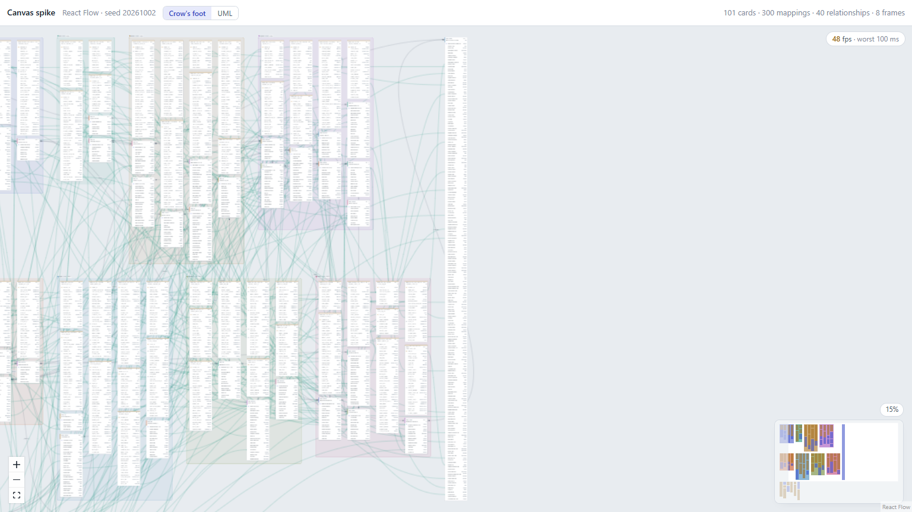 |
| The 200-row card at 100% | 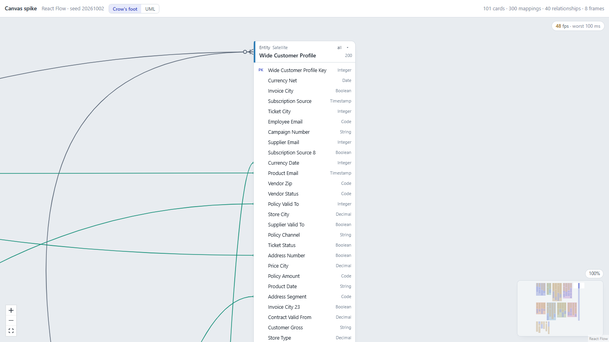 |
| Collapsed frame "Sales" with merged lines | 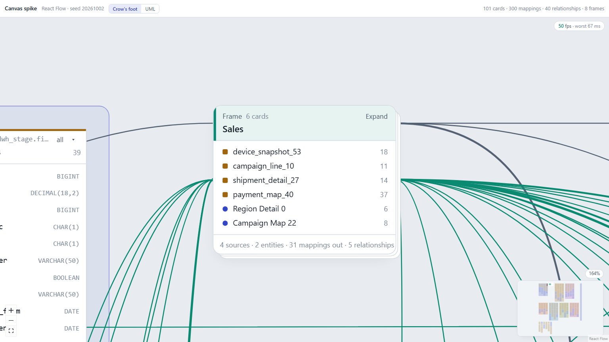 |
| All frames collapsed | 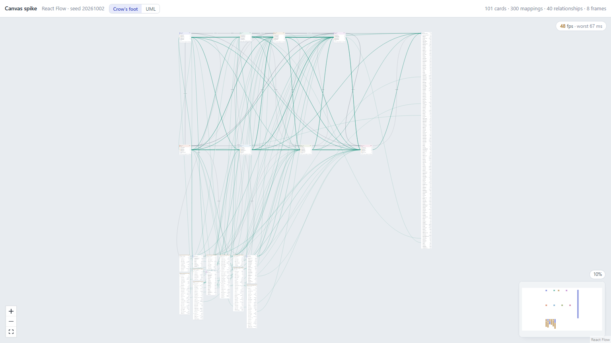 |
| Line ends at 25%, 100%, 300% | 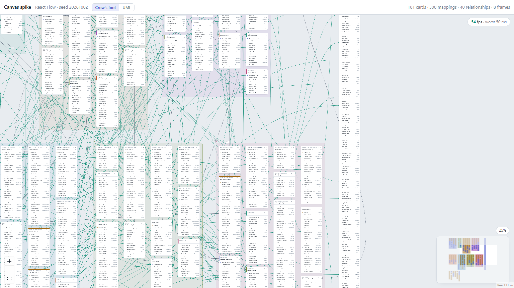 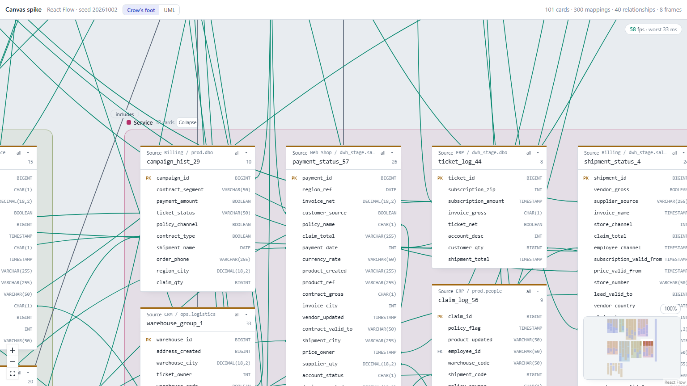 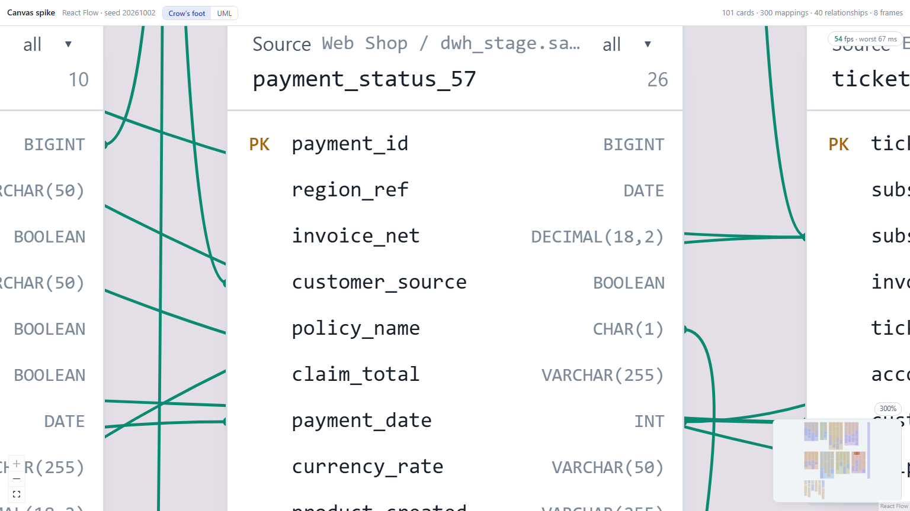 |
| Collapsed and filtered card (re-anchored lines) | 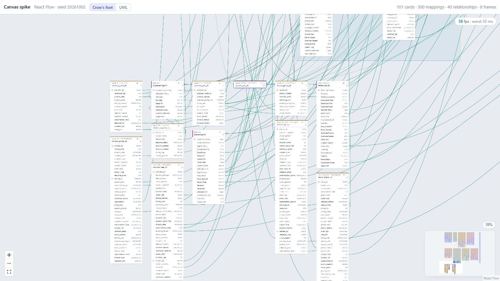 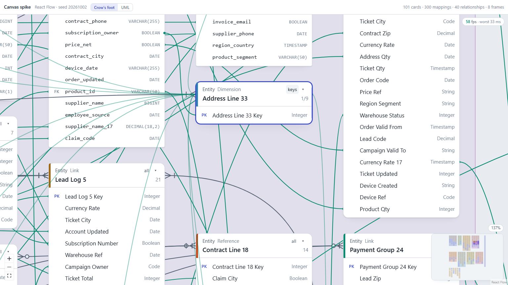 |
| Lasso result (two cards, the partly covered one not selected) | 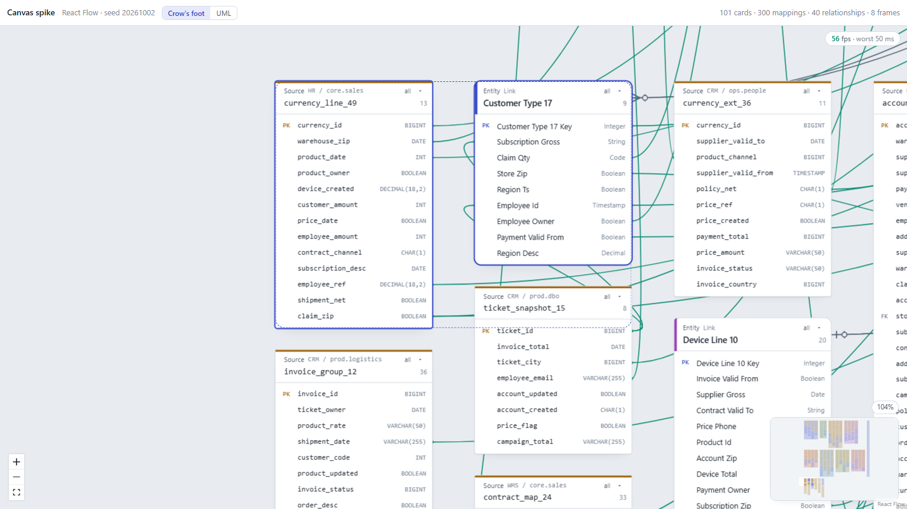 |
| Row hover highlight | 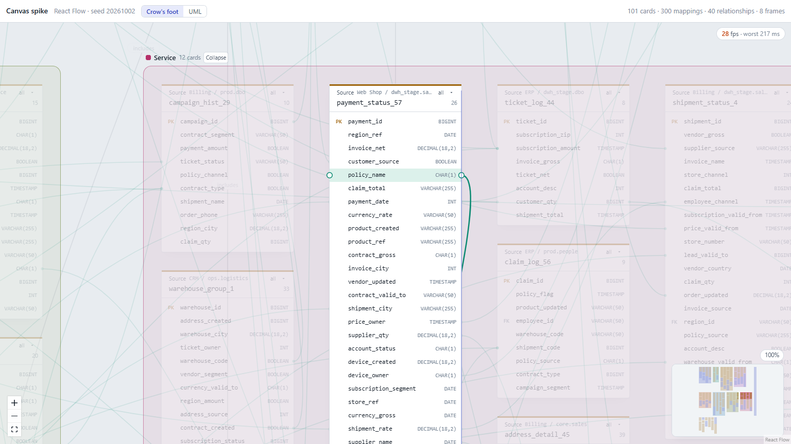 |
| Crow's foot and UML ends at 300%, labels | 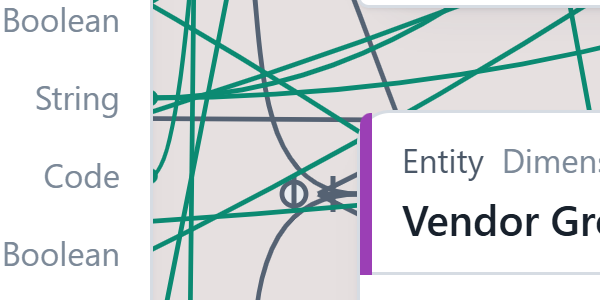 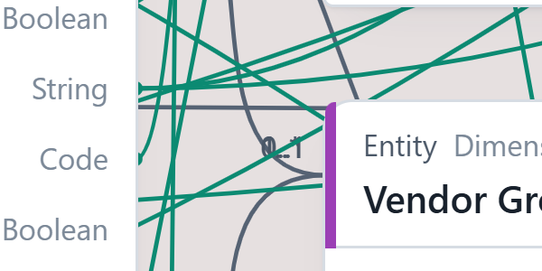 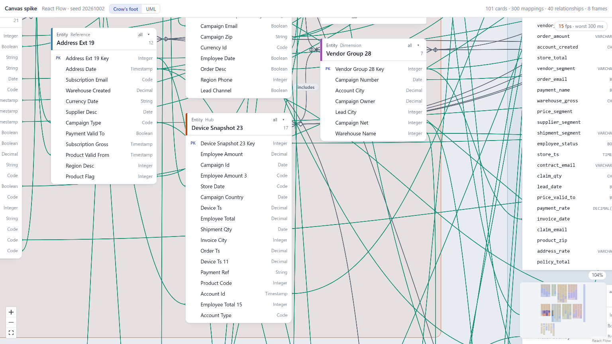 |
| Plain-DOM comparison page at 100% | 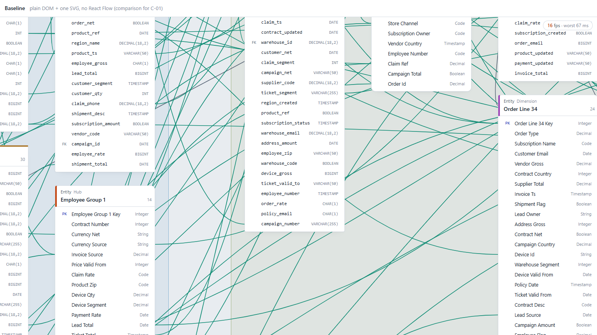 |

## Recommendation

**What the decision rule says:** a must-have (C-01) fails, and there is no small, stable workaround. Setup B gets close but costs C-09 and C-10. Read literally, that points to "build our own engine".

**Why that alone won't fix C-01:** the spike's comparison shows that an own engine modeled on the prototype (DOM cards, one SVG for lines) pans just as slowly with this amount of content. Switching engines doesn't remove the bottleneck; changing *what* is painted does. That applies to both paths.

**Recommendation: a hybrid. Keep React Flow for what passed, and change the rendering.**

- **Keep React Flow for:** the viewport and pan/zoom, selection and lasso, drag and group drag, frames as group nodes, the minimap and keyboard nudge. These passed with little or no work: C-02, C-06, C-07.
- **Do differently in the product:**
  1. **Detail by zoom level.** Below about 40% zoom, cards draw as header plus a plain block with no row text, and lines lose their end dots. At overview zoom the cards were the cost.
  2. **No React Flow handle per row.** Compute row positions from data, as the prototype does. This removes 4,674 DOM elements and the workaround-1 dependency on `internals.handleBounds`.
  3. **One layer for all mapping lines** instead of 340 separate `<svg>` elements: a single SVG or canvas overlay that reads node positions from React Flow's store. At 100% the lines were the cost.
  4. **Keep the CSS rules:** no opacity on repeated elements, no dotted background, and `will-change` only if steps 1–3 still need it.

**Before AD-24 is closed**, take one more day to add steps 1–3 to this spike and re-run `npx playwright test --project=measure`:
- **If C-01 passes and C-09/C-10 hold:** React Flow with the named workarounds.
- **If it still misses 50 fps:** the evidence points to canvas or WebGL rendering of cards and lines. Then an own engine is justified, because React Flow's DOM nodes are its core.

Łukasz takes the decision and records it in AD-24.

## Follow-up

Oct 3, 2026 · steps 1–3 from the recommendation, built into this spike and measured again.

### What changed

1. **Detail by zoom level.** Below 40% zoom a card shows its header and one plain block of the same height instead of its rows (`CardNode`, `.c-lod`). Lines lose their end dots. At the overview zoom this takes most of the 17,900 DOM elements out of the page.
2. **No React Flow handles.** Cards and frames have no `<Handle>` any more (the 4,674 row handles and the header handles are removed). A line end's y is computed from the card data: header 54 px, body padding 6 px, 26 px per shown row, taking collapse and filter into account (`geometry.rowEnd`). Workaround 1 (`internals.handleBounds`) and workaround 2 (`ConnectionMode.Loose`, declared header handles) are gone.
3. **One SVG layer for all lines.** React Flow gets no edges. `LineLayer` draws all 340 lines (mappings, relationships and merged lines) in one `<svg>` inside the viewport. It reads node positions and sizes from React Flow's store (`nodeLookup`) and re-renders only when nodes change, not on pan or zoom. Each line is memoised on its geometry, so dragging a card only updates the lines attached to it. The layer is portalled into React Flow's edge-label container (`EdgeLabelRenderer`). That container sits before the nodes in the viewport, so lines paint above frames and below cards, as the edges did.
4. **CSS rules kept:** no opacity on repeated elements, dotted background off, `will-change` setups B and C as before.

The functional checks still pass (12/12: C-03, C-05, C-06, C-07). The C-03 check at 25% compares line ends with the row's band inside the plain block, because rows are not rendered there.

### New numbers

Same machine, browser and data set as above (i7-8550U, UHD 620, Chrome 154, 1536 × 864). Raw numbers: `report/results-followup-b.json` (whole measure project) and `report/results-followup-c.json` (C-01, C-04, C-09, C-10). Screenshots from these runs: `report/followup/`.

| ID | Bar | Before, B | **Follow-up, B** | Before, C | **Follow-up, C** |
| --- | --- | --- | --- | --- | --- |
| C-01 overview | ≥ 50 fps, no frame > 50 ms | 40.9 fps, 3 frames > 50 ms | **60.0 fps, 0 frames > 50 ms** (longest 17 ms) | 25.5 fps | 46.6 fps, 4 frames > 50 ms (longest 50 ms) |
| C-01 100% | same | 44.5 fps, 2 frames > 50 ms | **58.3 fps, 0 frames > 50 ms** (longest 33 ms) | 25.7 fps | 33.0 fps, 56 frames > 50 ms |
| C-04 200-row card pan | same bar as C-01 | 42.4 fps, 0 > 50 ms | **53.1 fps, 0 frames > 50 ms**, 50/50 ends attached | 42.1 fps | 53.2 fps, 2 frames > 50 ms (longest 67 ms), 50/50 attached |
| C-09 resize smoothness | no visible lag | 3.6 fps | **4.0 fps** (longest frame 1.1 s) | 24.6 fps | 23.5 fps |
| C-10 hover → next frame | no visible delay | 403 ms median | **366 ms** median | 99 ms median | 69 ms median (p95 342 ms) |
| C-10 hover sweep | | 26.6 fps | 36.6 fps | 46.0 fps | 48.5 fps |

Setup B also re-measured, for reference: C-02 drag stays at 60 fps (one card and the 15-card group). C-08 initial render dropped from 1,061 ms to **789 ms** median (max 852 ms). Without `will-change` (and with the dotted background) the canvas now pans at 21.4 fps overview / 10.8 fps at 100% (before: 7.6 / 14.3). With `onlyRenderVisibleElements` it reaches 51.6 fps but 12 frames over 50 ms, so that switch is still not useful.

**Second machine:** not done. Only this laptop was available for the follow-up. C-01 on a newer machine is still open.

### What it means

- **C-01 passes in setup B,** with margin: 58–60 fps and no frame over 50 ms, against 41–45 fps before. C-04 passes on the same bar. All must-haves now pass in setup B.
- **The C-01 fix still costs C-09 and C-10 in setup B.** Resize and hover change content inside the one big GPU layer, and Chrome re-renders the whole layer. The steps did not change this (4 fps, 366 ms). It is the cost described in point 5 of [Why C-01 fails](#why-c-01-fails).
- **Setup C keeps resize and hover close to before (23.5 fps, 69 ms) but misses C-01** (47 / 33 fps). So no single setup passes C-01, C-09 and C-10 together on this laptop.
- **Steps 1–3 did what the report expected:** at overview the cards were the cost, and LOD removed it; at 100% the lines were the cost, and one layer plus no handles made B pass. The remaining conflict is between `will-change` on the whole viewport and live changes inside it. That is a rendering question, not a React Flow one: an own DOM engine would have the same trade-off.

Not measured, possible next step (not built): keep `will-change` on, but turn it off for the duration of a resize drag or while a row is hovered, and back on when the pointer leaves. That would combine B's pan with C's resize and hover, if the switch itself does not cause a visible re-render. C-09 and C-10 are should-haves, so this is not needed to decide AD-24.

Side effects of the steps, for the product: the row-hover dots (the prototype's `.hnd`) went away with the handles and would come back as plain elements; and below 40% zoom rows cannot be hovered or clicked, since they are not drawn.
